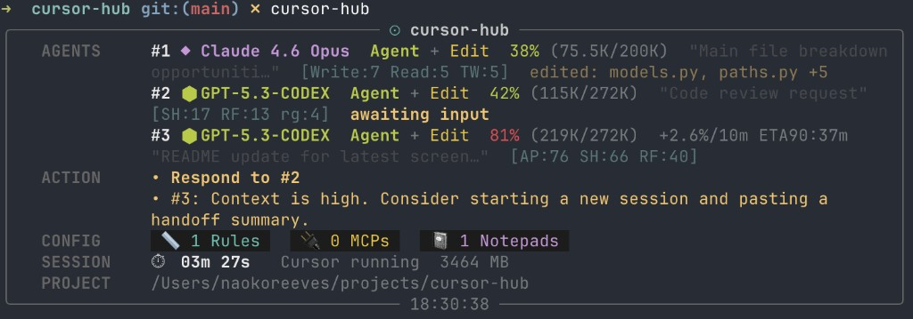

# cursor-hub

A live terminal HUD for [Cursor IDE](https://cursor.sh) — see your active model, context usage, loaded config, and session timer at a glance without leaving your terminal.



## Features

- **Model** — detects the active model from your Cursor settings (Claude, GPT-4o, Gemini, o3, Grok, and more)
- **Context bar** — 12-block visual meter, green → yellow → red as context fills up, with token count
- **Actions** — TODO-style action row for pending user input and high-context handoff suggestions
- **Config counts** — rules files, MCP servers, and notepads loaded for the current project
- **Session timer** — how long cursor-hub has been running, plus live Cursor process memory usage
- **Project path** — confirms which project directory and settings file are being read

## Install

```bash
pip install cursor-hub
```

Requires Python 3.10+. Dependencies ([rich](https://github.com/Textualize/rich), [psutil](https://github.com/giampaolo/psutil)) are installed automatically.

## Usage

```bash
# Live dashboard — refreshes every 2 seconds
cursor-hub

# Print once and exit
cursor-hub --once

# Target a specific project directory
cursor-hub --project ~/projects/my-app

# Custom refresh interval
cursor-hub --interval 5

# Show sessions across all Cursor workspaces
cursor-hub --all

# Show resolved settings file path in PROJECT row
cursor-hub --show-paths

# Override the displayed model without touching Cursor settings
CURSOR_MODEL=gpt-4o cursor-hub
```

You can also run it directly without installing:

```bash
pipx run cursor-hub
```

Press `Ctrl+C` to exit the live dashboard.

## How it works

cursor-hub reads directly from Cursor's config files — no API calls, no extensions, no Cursor restart required.

| Row | What is read |
|---|---|
| **Model** | `.cursor/settings.json` (`cursor.chat.defaultModel`), then global Cursor `settings.json` |
| **Context** | `workspaceStorage/<hash>/` — matches project path via `workspace.json`, estimates token usage from chat state file sizes (~4 chars per token) |
| **Rules** | `.cursorrules` (legacy) + `.cursor/rules/*.mdc` (new-style) + `~/.cursor/rules/*.mdc` (global) |
| **MCPs** | `~/.cursor/mcp.json` + `.cursor/mcp.json`, merged |
| **Notepads** | `.cursor/notepads/*.md` |
| **Session** | Script start time; process memory from `psutil` |

### Config file locations

| OS | Global settings |
|---|---|
| macOS | `~/Library/Application Support/Cursor/User/settings.json` |
| Linux | `~/.config/Cursor/User/settings.json` |
| Windows | `%APPDATA%\Cursor\User\settings.json` |

Global MCP and rules always live at `~/.cursor/` regardless of OS.

## Supported models

cursor-hub recognizes all models available in Cursor as of mid-2025:

| Provider | Models |
|---|---|
| Anthropic | Claude Opus 4, Sonnet 4, Sonnet 3.7 / 3.5, Haiku 3.5, Claude 3 Opus |
| OpenAI | GPT-4.1, GPT-4o, GPT-4 Turbo, o1, o3, o4-mini |
| Google | Gemini 2.5 Pro, 2.0 Flash, 1.5 Pro |
| xAI | Grok 3 |
| DeepSeek | DeepSeek (all variants) |
| Cursor | Cursor Small |

Any unrecognized model string is displayed as-is with a neutral style.

## Tips

**Run alongside your terminal workflow**

Open a small terminal split in your editor or iTerm2/Wezterm and run `cursor-hub` there. It uses very little CPU since it reads files rather than polling an API.

**Point it at any project**

```bash
cursor-hub --project ~/projects/race-kiroku
```

Useful if you want to monitor a project from a different terminal window.

**Check context before a big prompt**

Use `--once` to get a quick snapshot before pasting a large file or kicking off a long agentic task, so you know how much headroom you have.

```bash
cursor-hub --once
```

## Limitations

- Context token counts are **estimates** based on chat state file sizes. Cursor does not expose exact token counts externally.
- Model detection requires the model to be explicitly set in `settings.json`. If you rely on Cursor's UI default without saving, the field may not be written to disk.
- Process memory reflects the entire Cursor process, not just the AI context.

## License

MIT
